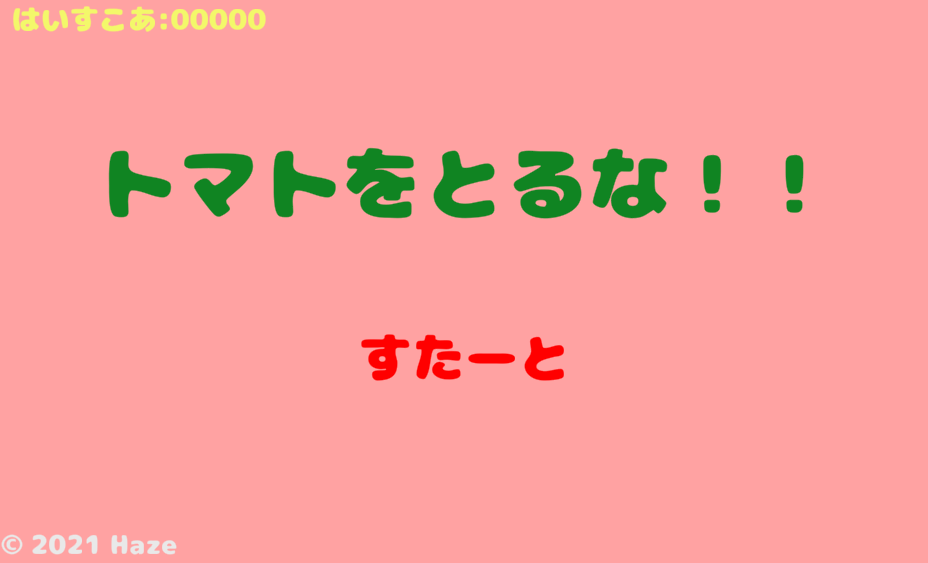
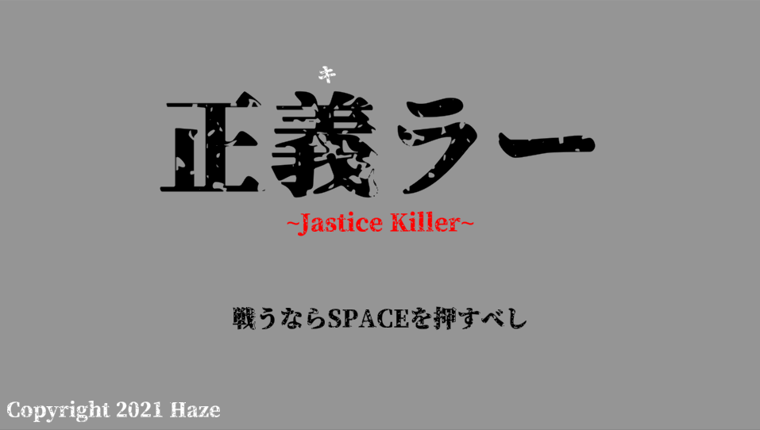
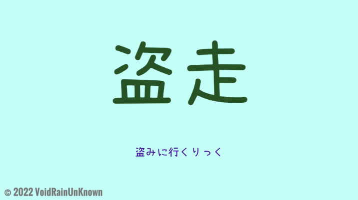

# Portfolio
※随時更新
## 【自己紹介】
- **名前**
  - 本名「松橋 霞」
  - ゲーム開発「Haze」
  - ボカロP「水魔蠍」
- **学歴**
  - 学校法人角川ドワンゴ学園 N高等学校
    - ネットコース(2021年3月卒業)
  - 専門学校デジタルアーツ東京
    - ゲーム学科 ゲームプログラムコース(2023年卒業予定)
- **連絡先**
   - Email「[学校&就活用](da2gp.amber@gmail.com)」
   - Twitter「[ゲーム関係](https://twitter.com/SaSoRi_ZG)」
   「[動画投稿関係](https://twitter.com/rde_arankuraizu)」
- **チーム**
  - RedDarkEmperor \~赤い闇の天帝\~
    - HP → [制作中]()
    - 連絡先 → [Twitter](https://twitter.com/rde_maougun)、[Email](RedDarkEmperor4@gmail.com)
    - 担当 → 作詞、映像、宣伝、シナリオ
  - VoidRainUnknown \~虚無雨未知\~
    - HP → [制作中]()
    - 連絡先 → [Twitter開設予定]()、[Email開設予定]()
    - 担当 → 企画、シナリオ、プログラム

## 【資格】
- 文部科学省 日本商工議会所 珠算能力検定 2級合格
- 日本商工会議所 協賛 日本珠算連盟 暗算検定試験 3級合格
- 文部科学省後援 ビジネス能力検定ジョブパス 3級合格
- PTNA 社団法人 全日本ピアノ指導者協会 ピティナ・ピアノ演奏検定 合格
- 3月中に普通車の免許習得予定

## 【スキル一覧】
##### 言語
- **C言語**
  - コンソールで簡単なデータ処理プログラム
- **C++**
  - コンソールで簡単なデータ処理プログラム
  - 簡易的なハエ叩きゲームの制作
- **C#**
  - Windows Formでちょっとしたアプリ作成
  - Unityで開発する中で使用
- **HTML**
  - 簡易的なホームページの作成
- **CSS**
  - HTMLで作成したホームページの簡易的な装飾
##### ゲーム開発
- **Unity**
  - 個人とチームでオリジナルゲームの開発
- **RPGツクール**
  - 個人でオリジナルRPGゲームの制作
- **ティラノビルダー**
  - 個人でオリジナルノベルゲームの制作
- **Adobe XD**
  - オリジナルおみくじゲームの制作
##### その他
- **Adobe AfterEffect**
  - 簡単なアニメーション作成
  - 簡単なエフェクトの作成
- **Adobe Photoshop**
  - 画像加工
  - エフェクト素材の作成
- **Adobe illustrator**
  - ロゴ制作
- **Sprite Studio**
  - 2Dキャラの簡易アニメーション作成
  - ガチャ演出作成
- **Fimore**
  - 動画編集
- **Studio One**
  - オリジナルVOCAROID曲の作成
- **MikuMikuDance**
  - 既存の踊り,表情データを身長や性格に合わせた動きに改変
  - カメラワークの作成

## 【テーマ】
#### ◇ 現在取り組んでいる
- 音楽ゲームの譜面制作
- 自動移動のアクションゲーム
- Unityで作るノベルゲーム
- 育成のやつ
- 自然なアニメーション制作
- ドット絵のエフェクト作成
- RPGの設定

[色々](https://drive.google.com/drive/folders/1uu_f6LxS0uS0D7-Y9JxvpuR512hdkisS?usp=sharing)

#### ◇ 今後取り組む予定
- UnrealEngeneでゲーム制作
- Mayaまたはblenderで3Dモデル制作
- Live2D
- AIを使ったなんか

#### ◇ 将来的に
- どのジャンルのゲームでも作れるようになる
- ゲーム実況者に実況され、アニメ化まで行くフリゲーを作る
- 「DQ」「FF」「テイルズ オブ」等の有名シリーズの開発に関わる仕事をする
- シリーズ物のRPGで名を馳せたい(｀・ω・)

## 【作品一覧】

### ★ゲーム開発★
#### トマトをとるな！

[限定公開](https://unityroom.com/games/tomatoruna)
- 開発環境：Unity 2019.4.11f
- 開発人数：1人
- 制作期間：約3週間
- 用途：夏休みの課題、落ちゲー作品初

#### SUPER UNITYCHAN SISTERS 1

非公開
- 開発環境：Unity 2019.4.11f
- 開発人数：4人
- 制作期間：約2ヶ月
- 用途：学園祭での展示、初のチーム制作

#### 正義ラー \~Justice Killer\~

[一般公開](https://unityroom.com/games/JusticeKiller)
- 開発環境：Unity 2019.4.11f
- 開発人数：1人
- 制作期間：約1週間
- 用途：正月休みの課題、1週間ゲームジャム お題「正」に参加

#### 盗走

制作中(2月中にUnityroomで公開予定)
- 開発環境：Unity 2019.4.11f
- 開発人数：2人
- 制作期間：10月～
- 用途：自動移動ACG、2Dに挑戦

#### No.Music

制作中(1曲分出来れば公開する予定)
- 開発環境：Unity 2020.
- 開発人数：1人
- 制作期間：1月～
- 用途：譜面制作の理解、選択のやつ、自曲で音ゲーしたい

#### スライムのなんか

企画纏め中(日本ゲーム大賞に出すか悩み)
- 開発環境：
- 開発人数：
- 制作期間：
- 用途：関節がないキャラの操作、テーマ「感触」

#### ノベルスとゲーム学科のコラボ

会議中(甲子園で出すらしい)
- 開発環境：Unity
- 開発人数：8人
- 制作期間：12月下旬～
- 用途：他分野も含めたチームでの制作

#### 色レンジャー(仮)

企画纏め中(甲子園で出すか悩み)
- 開発環境：Unity
- 開発人数：2人(もう少しほしい)
- 制作期間：10月～
- 用途：自然なアニメーション、切り替えの管理(?)

#### ヤンデレ×魔法のなんか

企画纏め中
- 開発環境：
- 開発人数：
- 制作期間：
- 用途：ドット絵、企画主の性癖暴走ゲーム

### ★その他★
オリジナルボカロ曲 → [YouTube](https://www.youtube.com/channel/UCwpQZsbNkCLVe-7W4WtbELg) [ニコニコ動画](https://www.nicovideo.jp/user/50454211)

デザイン → [Pixiv](https://www.pixiv.net/users/764106859)

※2022年中にHP作るのでそっちで細かく書きます
