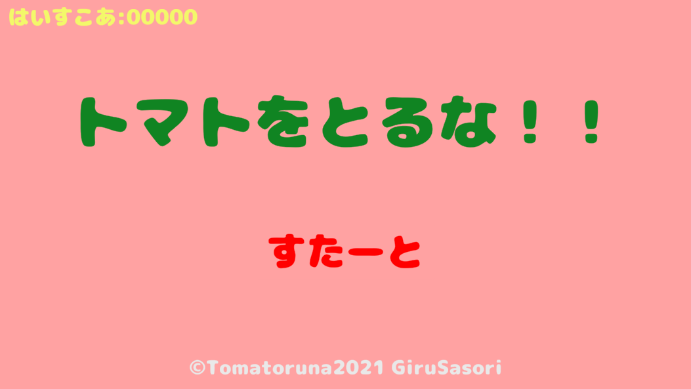
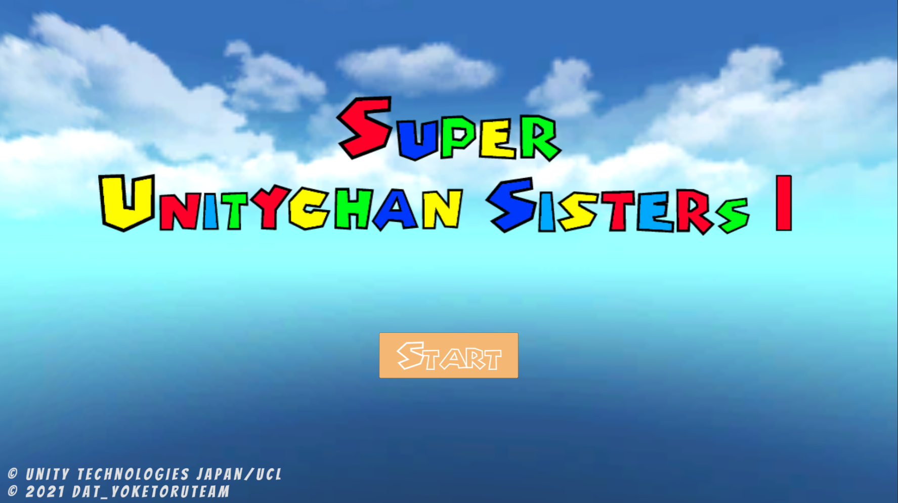
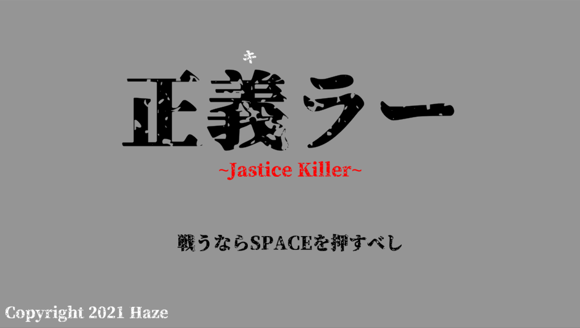

# Portfolio
まだ途中です！！！！！
## 【自己紹介】
- **名前**
  - 本名「松橋 霞」
  - ゲーム開発「Haze」
  - ゲームプレイ「サソリ」「戯涙」「Rune」etc...
  - ボカロP「水魔蠍」
- **学歴**
  - 学校法人角川ドワンゴ学園 N高等学校
    - ネットコース(2021年3月卒業)
  - 専門学校デジタルアーツ東京
    - ゲーム学科 ゲームプログラムコース(2023年卒業予定)
- **連絡先**
   - Email「[学校&就活用](da2gp.amber@gmail.com)」
   - Twitter「[ゲーム関係](https://twitter.com/SaSoRi_ZG)」
   「[動画投稿関係](https://twitter.com/rde_arankuraizu)」
- **チーム**
  - RedDarkEmperor \~赤い闇の天帝\~
    - HP → [制作中]()
    - 連絡先 → [Twitter](https://twitter.com/rde_maougun)、[Email](RedDarkEmperor4@gmail.com)
    - 担当 → 作詞、映像、宣伝、シナリオ
  - VoidRainUnknown \~虚無雨未知\~
    - HP → [制作中]()
    - 連絡先 → [Twitter開設予定]()、[Email開設予定]()
    - 担当 → 企画、シナリオ、プログラム

## 【資格】
- 珠算２級
- 暗算３級

## 【スキル一覧】
##### 言語
- **C言語**
  - コンソールで簡単なデータ処理プログラム
- **C++**
  - コンソールで簡単なデータ処理プログラム
  - ハエ叩きゲームの開発
- **C#**
  - Windows Formでちょっとしたアプリ作成
  - Unityで開発する中で使用
- **HTML**
  - 簡易的なホームページの作成
- **CSS**
  - HTMLで作成したホームページの装飾
##### ゲーム開発
- **Unity**
  - 個人とチームでオリジナルゲームの開発
- **RPGツクール**
  - 個人でオリジナルRPGゲームの制作
- **ティラノビルダー**
  - 個人でオリジナルノベルゲームの制作
- **Adobe XD**
  - オリジナルおみくじゲームの制作
##### その他
- **Adobe AfterEffect**
  - 簡単なアニメーション作成
  - 簡単なエフェクトの作成
- **Adobe Photoshop**
  - 画像加工
  - エフェクト素材の作成
- **Adobe illustrator**
  - ロゴ制作
- **Sprite Studio**
  - 2Dキャラの簡易アニメーション作成
  - ガチャ演出作成
- **Fimore**
  - 動画編集
- **Studio One**
  - オリジナルVOCAROID曲の作成
- **MikuMikuDance**
  - 既存の踊り,表情データを身長や性格に合わせた動きに改変
  - カメラワークの作成

##【取り組み中】
- 音楽ゲームの譜面制作
- Unityで作るノベルゲーム
- 自動移動のアクションゲーム
- 育成系のやつ

## 【作品一覧】
**とまとをとるな！**

[限定公開](https://unityroom.com/games/tomatoruna)
- 開発環境：Unity 2019.4.11f
- 開発人数：1人
- 制作期間：約3週間
- 用途：夏休みの課題

**SUPER UNITYCHAN SISTERS 1**

非公開
- 開発環境：Unity 2019.4.11f
- 開発人数：4人
- 制作期間：約1ヶ月
- 用途：学園祭での展示

**正義ラー \~Justice Killer\~**

[一般公開](https://unityroom.com/games/JusticeKiller)
- 開発環境：Unity 2019.4.11f
- 開発人数：1人
- 制作期間：約1週間
- 用途：正月休みの課題、1週間ゲームジャム お題「正」に参加
